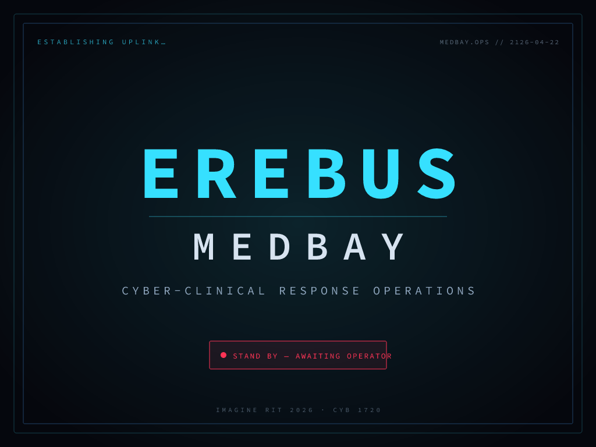

# EREBUS MedBay

A cyberpunk medical-bay cybersecurity exhibit for **Imagine RIT 2026** (2026-04-25, CYB 1720). Visitors play a "Cyber-Clinical Response Operator" aboard a space-station MedBay — diagnosing and defending three networked medical devices under active attack. One part of the four-room EREBUS exhibit (Command Deck, Academy Sector, **MedBay**, Engineering Deck).

<p align="center">
  
</p>

The threat models are grounded in real CVEs and CISA advisories:

| Station | Device | Real-world basis |
|---|---|---|
| Triage | Generic bedside pulse/BP monitor | Evil-twin / rogue AP (CISA-tracked pattern) |
| Trauma | GE DASH 3000 | **MDhex** — CVE-2020-6963 (CISA ICSMA-20-023-01, Jan 2020) |
| ICU | Masimo Radical-7 | Firmware backdoor + outbound beacon — pattern from Contec CMS8000 (CISA ICSMA-25-030-01, Jan 2025) |

## What's in the repo

- **[`prototype/`](prototype/)** — the interactive scenario as a PWA. Three station click-throughs, mission-control overview, splash/intro/closeout. Installs to home screen on Chromebook / Android tablet, runs offline.
- **[`prototype/export/panels/`](prototype/export/panels/)** — 27 pre-rendered 1024×768 PNG panels ready to drop into ShapesXR as textured planes (20 step panels + splash + intro + closeout + 4 mission-control states).
- **[`export-svg.mjs`](export-svg.mjs)** — Node script that generates all panel SVGs from [`prototype/content.js`](prototype/content.js) (the single source of truth for every string).
- **[`svg-to-png.sh`](svg-to-png.sh)** — renders the SVGs to PNGs via `@resvg/resvg-js-cli` (~20s for all 27).
- **[`shapesxr-build-spec.md`](shapesxr-build-spec.md)** — how to assemble the actual VR scene: frame lists, trigger wiring, asset inventory, 6-day build schedule.
- **[`deploy.md`](deploy.md)** — how to host the PWA (Netlify Drop is the 2-minute path).

## Try it locally

```bash
cd prototype && python3 -m http.server 5173
open http://localhost:5173
```

No build step. Pure HTML + ES modules + static assets. Works in any modern browser.

## Regenerate the ShapesXR panels

Edit [`prototype/content.js`](prototype/content.js) (the scenario copy), then:

```bash
node export-svg.mjs   # 27 SVGs → prototype/export/svg/
./svg-to-png.sh        # 27 PNGs → prototype/export/panels/
```

Requires Node 22+ and `npx` (downloads resvg-js on first run).

## Deploy as an installable app

See [deploy.md](deploy.md). Fastest path: drag `prototype/` onto https://app.netlify.com/drop, visit the returned URL on a Chromebook/tablet, Chrome menu → **Install app**. The device runs offline from cache after first load.

## Context

Healthcare cybersecurity education for a public audience. Every attack shown is based on publicly disclosed material (CVEs, CISA advisories, FDA Section 524B / PATCH Act framing). The sci-fi framing makes it legible to families and K-12 visitors without sacrificing technical accuracy — the defensive controls at each station (VLAN segmentation, NAC, passive device monitoring, signed firmware, egress filtering, SBOMs) are what real hospital CISO/biomed teams actually use.

Built for [Imagine RIT 2026](https://www.rit.edu/imaginerit/) by [Justin M. Pelletier](mailto:jxpics@rit.edu) at Rochester Institute of Technology, with scenario/asset generation collaboration via [Claude Code](https://claude.com/claude-code).

## License

Code and content © 2026. No license granted yet — open an issue if you want to adapt it for your own exhibit and we'll figure it out.
